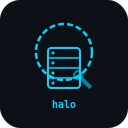

<div align="center">

🌐 [English](README.md) | [Français](README.fr.md) | [Español](README.es.md) | [Deutsch](README.de.md) | [Português](README.pt.md) | [日本語](README.ja.md) | [中文](README.zh.md) | [한국어](README.ko.md) | [Русский](README.ru.md) | [हिन्दी](README.hi.md) | **العربية**

<picture>
  
</picture>

# halo-ai core

### الأساس المعدني للذكاء الاصطناعي لمعالج amd strix halo

**8 خدمات أساسية · 128 جيجابايت ذاكرة موحدة · lemonade + llama.cpp + kokoro tts · بدون سحابة · قطع ليغو**

*ختم المعماري*

[](https://github.com/stampby/halo-ai-core/actions/workflows/ci.yml)
[](https://github.com/stampby/halo-ai-core/actions/workflows/codeql.yml)
[](https://archlinux.org)
[](https://rocm.docs.amd.com)
[](https://github.com/lemonade-sdk/lemonade)
[](https://github.com/remsky/Kokoro-FastAPI)
[](LICENSE)
[](https://discord.gg/dSyV646eBs)
[](docs/wiki/Home.md)
[](https://medium.com/@stampby)
[](https://www.youtube.com/@halo-ai.studio)
[](docs/SECURITY.md)
[](https://github.com/stampby/halo-ai-core)
[](https://github.com/stampby/halo-ai-core-bleeding-edge)

</div>

---

> **[الويكي](docs/wiki/Home.md)** — 24 صفحة توثيق · **[ديسكورد](https://discord.gg/dSyV646eBs)** — مجتمع + دعم · **[الدروس](https://www.youtube.com/@DirtyOldMan-1971)** — شروحات فيديو

---

## ما هذا

الطبقة الأساسية لتشغيل الذكاء الاصطناعي المحلي على عتادك الخاص. سكريبت واحد يُثبّت كل شيء. ثماني خطوات، كلها systemd، كلها إعادة تشغيل تلقائي، كل شيء يمر عبر lemonade server على :13305. ssh فقط. *"i know kung fu."* *(أنا أعرف الكونغ فو.)*

## التثبيت

```bash
git clone https://github.com/stampby/halo-ai-core.git
cd halo-ai-core
./install.sh --dry-run    # شاهد ما سيحدث أولاً
./install.sh --yes-all    # ثبّت كل شيء
./install.sh --status     # تحقق مما يعمل
```

[](halo-ai-core-install.cast) *~3 دقائق على عتاد strix halo*

## ماذا تحصل

| | |
|---|---|
| **gpu** | rocm 7.12.0 — ذاكرة موحدة كاملة 128 جيجابايت على gfx1151 |
| **الاستدلال** | llama.cpp (Vulkan) — عبر واجهة llamacpp الخلفية في lemonade. بدون تجميع. *(شكراً u/Look_0ver_There)* |
| **الواجهة الخلفية** | lemonade server 10.2.0 — موجّه موحد على :13305. متوافق مع openai + anthropic + ollama |
| **الصوت** | kokoro tts (cpu) + whisper.cpp (vulkan) — تحويل الكلام لنص ونص لكلام |
| **البرمجة** | claude code — وكيل برمجة ai محلي، يُشغّل عبر lemonade |
| **البوابة** | caddy 2.x — لوحة تحكم على :80 |
| **vpn** | wireguard — امسح رمز qr، ادخل لمكدسك من هاتفك |
| **لوحة التحكم** | خادم إحصائيات على :5090 — gpu، ذاكرة، خدمات، تحميل تلقائي عند الإقلاع |

```
┌──────────────────────────────────────────────────┐
│                   Caddy (:80)                    │
├──────────────────────────────────────────────────┤
│           Lemonade Server (:13305)               │
│     موجّه موحد — جميع الـ api، جميع الواجهات الخلفية      │
├────────────┬─────────────┬───────────────────────┤
│ llama.cpp  │  whisper.cpp │  kokoro tts          │
│  (Vulkan)  │  (Vulkan)    │  (CPU)               │
├────────────┴─────────────┴───────────────────────┤
│  Claude Code  │  لوحة التحكم (:5090)  │ WireGuard │
├───────────────┴───────────────────────┴──────────┤
│              ROCm 7.12.0 (gfx1151)               │
├──────────────────────────────────────────────────┤
│          Arch Linux / systemd / btrfs            │
└──────────────────────────────────────────────────┘
```

> **[شاهد التثبيت الكامل](halo-ai-core-install.cast)** — تثبيت نظيف مسجّل على strix halo. انسخ المستودع وشغّل `asciinema play halo-ai-core-install.cast` لمشاهدته مباشرة.

## اختبارات الأداء — جاهز من العلبة

هذه الأرقام من `install.sh --yes-all` نظيف على عتاد strix halo. بدون ضبط يدوي. بدون حيل. سكريبت التثبيت يطبّق جميع التحسينات تلقائياً. اختبارات الأداء أُجريت عبر واجهة lemonade sdk api بواسطة claude code.

| النموذج | التكميم | الاختبار | prompt tok/s | gen tok/s | TTFT |
|---------|---------|----------|-------------|----------|------|
| qwen3-30B-A3B | Q4_K_M | قصير (13→256) | **251.7** | **73.0** | 52ms |
| qwen3-30B-A3B | Q4_K_M | متوسط (75→512) | **494.3** | **72.5** | 152ms |
| qwen3-30B-A3B | Q4_K_M | طويل (39→1024) | **385.9** | **71.9** | 101ms |
| qwen3-30B-A3B | Q4_K_M | مستمر (54→2048) | **437.0** | **70.5** | 124ms |

*توليد ثابت 70-73 tok/s بدون تدهور على 2048 توكن. 18 جيجابايت من 64 جيجابايت vram مستخدمة. ttft أقل من 200ms. اختُبر 2026-04-08.*

### ما يجعله سريعاً

- **lemonade server** — موجّه موحد على :13305. متوافق مع openai وanthropic وollama. نقطة نهاية واحدة لكل شيء.
- **llama.cpp (Vulkan)** — واجهة Vulkan الخلفية المُعدّة مسبقاً عبر Lemonade. بدون تجميع، بدون ترقيعات. يعمل على أي GPU يدعم Vulkan. *(h/t u/Look_0ver_There)*
- **kokoro tts** — تحويل نص لكلام سريع على المعالج. 9 لغات.
- **whisper.cpp (Vulkan)** — تحويل كلام لنص مع تسريع gpu.
- **محسّن لـ gfx1151** — كل ملف ثنائي يستهدف شريحتك بالضبط. بدون بناءات عامة.
- **128 جيجابايت ذاكرة موحدة** — لا حدود VRAM. حمّل نماذج 35B بدون تردد.

لا تحتاج للبحث عنها. لا تحتاج لتهيئتها. `install.sh` يفعل ذلك من أجلك. هذا هو المغزى.

## وصول فوري من الهاتف — امسح وانطلق

عند انتهاء التثبيت، يظهر رمز qr في الطرفية. افتح تطبيق wireguard على هاتفك، امسحه، وستكون متصلاً بمكدس الذكاء الاصطناعي بالكامل. بدون توجيه منافذ. بدون وسيط سحابي. بدون تهيئة. فقط امسح وانطلق.

```
  ┌──────────────────────────────────────────┐
  │  امسح بهاتفك                              │
  │  تطبيق WireGuard → + → مسح رمز QR        │
  └──────────────────────────────────────────┘

         ▄▄▄▄▄▄▄  ▄▄▄▄▄  ▄▄▄▄▄▄▄
         █ ▄▄▄ █ ██▀▄ █  █ ▄▄▄ █
         █ ███ █ ▄▀▀▄██  █ ███ █
                  (رمز QR الخاص بك هنا)

  IP VPN الهاتف: 10.100.0.2
  Lemonade:     http://10.100.0.1:13305
  Gaia:         http://10.100.0.1:4200
```

vpn wireguard. نفق مشفر. هاتفك يتحدث مباشرة مع مكدسك عبر شبكتك المحلية. يعمل من أي مكان على wifi — أو من أي مكان في العالم إذا وجّهت udp 51820.

> *ميزة اقترحها زاك بارو. إنجاز كبير. برافو.*

## الفلسفة

كل قطعة تُركّب وتُفكّ. لا تبعيات صلبة. لا ارتباط بمورّد. لا قيود سحابية.

صناعة الذكاء الاصطناعي تريدك أن تستأجر حاسوب شخص آخر. نحن نعتقد أنه يجب أن تملك كامل المكدس — العتاد، النماذج، البيانات، خط الأنابيب. عندما تتحكم في برمجياتك، تتحكم في مصيرك. لا مفاتيح api تنتهي صلاحيتها الساعة الثانية صباحاً. لا شروط خدمة تتغير تحت قدميك.

هذا هو النواة. كل شيء آخر قطعة ليغو تختار أن تضيفها.

> *"they get the kingdom. they forge their own keys."* *(يحصلون على المملكة. يصنعون مفاتيحهم بأنفسهم.)*

## التكامل مع الخدمات المدفوعة

محلي أولاً. سحابي عندما تريد. رابط واحد، كل مزوّدي الذكاء الاصطناعي الرئيسيين.

<div align="center">

[](https://github.com/stampby/halo-ai.services)
[](https://github.com/stampby/halo-ai.services)
[](https://github.com/stampby/halo-ai.services)
[](https://github.com/stampby/halo-ai.services)
[](https://github.com/stampby/halo-ai.services)
[](https://github.com/stampby/halo-ai.services)
[](https://github.com/stampby/halo-ai.services)
[](https://github.com/stampby/halo-ai.services)
[](https://github.com/stampby/halo-ai.services)
[](https://github.com/stampby/halo-ai.services)
[](https://github.com/stampby/halo-ai.services)
[](https://github.com/stampby/halo-ai.services)

**[halo-ai.services →](https://github.com/stampby/halo-ai.services)** — أدلة التكامل، أنماط التوجيه، إدارة مفاتيح api

</div>

> *"sometimes you gotta run before you can walk."* *(أحياناً عليك أن تركض قبل أن تمشي.)* — halo-ai يعمل محلياً. الخدمات المدفوعة هي مخرج الطوارئ، وليست الأساس.

## قطع ليغو

النواة هي الأساس. ركّب ما تحتاجه:

| القطعة | ماذا تفعل | الحالة |
|--------|----------|--------|
| **ssh mesh** | شبكات متعددة الأجهزة (افتراضي، يعمل في أي مكان) | [الدليل →](docs/wiki/SSH-Mesh.md) |
| **vlan tagging** | عزل شبكة 802.1Q (يتطلب مبدّل مُدار) | [الدليل →](docs/wiki/Network-Layout.md) |
| **خط الصوت** | whisper + kokoro tts | [الدليل →](docs/wiki/Voice-Pipeline.md) |
| **open webui** | واجهة دردشة | مخطط |
| **comfyui** | توليد صور/فيديو | مخطط |
| **خوادم ألعاب** | إدارة الأركيد | مخطط |
| **glusterfs** | تخزين موزع | مخطط |
| **بوتات ديسكورد** | وكلاء ai في ديسكورد | مخطط |

[كيف تبني قطعتك الخاصة →](docs/wiki/Adding-a-Service.md)

## جاهز من العلبة

ثبّت النواة، افتح المتصفح، ابدأ التحدث مع ذكائك الاصطناعي. لا حاجة لسطر الأوامر.

## موصى به: الوكلاء الأساسيون

النواة تعمل بدون وكلاء. لكن هؤلاء الخمسة سيراقبون مكدسك عندما لا تكون موجوداً.

| الوكيل | المهمة |
|--------|--------|
| **sentinel** | الأمان — يفحص، يراقب، لا يثق بشيء |
| **meek** | المدقق — تدقيق يومي من 17 فحصاً، سلسلة التوريد |
| **shadow** | السلامة — مفاتيح ssh، تجزئات الملفات، صحة الشبكة |
| **pulse** | المراقب — حرارة gpu، الذاكرة، القرص، صحة الخدمات |
| **bounty** | الأخطاء — يلتقط الأخطاء، ينشئ سلاسل إصلاح تلقائياً |

هذه توصية وليست متطلباً. [دليل الوكلاء الأساسيين →](docs/wiki/Core-Agents.md)

## الأمان

مفاتيح ssh فقط. لا كلمات مرور. لا منافذ مفتوحة. لا استثناءات. جميع الخدمات على 127.0.0.1. *"you shall not pass."* *(لن تمر.)*

```bash
ssh-keygen -t ed25519
ssh-copy-id bcloud@10.0.0.10
```

[دليل الأمان الكامل →](docs/SECURITY.md)

## الخصوصية

**صفر قياس عن بُعد. صفر تتبع. صفر جمع بيانات.** لا شيء يتصل بالخارج. بياناتك تبقى على جهازك. *"there is no cloud. there is only zuul."* *(لا توجد سحابة. يوجد فقط زوول.)*

## التوثيق

| الدليل | ما يغطيه |
|--------|----------|
| [البدء](docs/wiki/Getting-Started.md) | التثبيت، التحقق، الخطوات الأولى |
| [المكونات](docs/wiki/Components.md) | rocm، caddy، llama.cpp، lemonade، gaia |
| [الهندسة المعمارية](docs/wiki/Architecture.md) | كيف تتصل القطع ببعضها |
| [إضافة خدمة](docs/wiki/Adding-a-Service.md) | ركّب قطعة ليغو خاصة بك |
| [إدارة النماذج](docs/wiki/Model-Management.md) | تحميل، تبديل، قياس أداء النماذج |
| [نظرة عامة على الوكلاء](docs/wiki/Agents-Overview.md) | 17 ممثل llm |
| [قياسات الأداء](docs/wiki/Benchmarks.md) | أرقام الأداء |
| [استكشاف الأخطاء](docs/wiki/Troubleshooting.md) | إصلاحات شائعة |
| [الويكي الكامل — 24 صفحة](docs/wiki/Home.md) | كل شيء |

## الخيارات

```
./install.sh --dry-run        معاينة بدون تثبيت
./install.sh --yes-all        تثبيت كل شيء
./install.sh --status         التحقق مما يعمل
./install.sh --skip-rocm      تخطي أي مكون
./install.sh --help           جميع الخيارات
```

## المتطلبات

- arch linux (معدن مكشوف)
- عتاد amd ryzen ai (strix halo / strix point)
- sudo بدون كلمة مرور

## الشكر والتقدير

هذا المشروع موجود بفضل الأشخاص الذين بنوا الأدوات التي نقف عليها.

شكر خاص لـ [Light-Heart-Labs](https://github.com/Light-Heart-Labs) و [DreamServer](https://github.com/Light-Heart-Labs/DreamServer) — المنارة التي أنارت الطريق. لولا ذلك المشروع، لما وُجد شيء من هذا.

مبني على [llama.cpp](https://github.com/ggml-org/llama.cpp)، [Lemonade SDK](https://github.com/lemonade-sdk/lemonade)، [AMD Gaia](https://github.com/amd/gaia)، [Caddy](https://caddyserver.com)، [ROCm](https://github.com/ROCm/TheRock)، [whisper.cpp](https://github.com/ggerganov/whisper.cpp)، [Kokoro](https://github.com/remsky/Kokoro-FastAPI)، [ComfyUI](https://github.com/comfyanonymous/ComfyUI)، [Open WebUI](https://github.com/open-webui/open-webui)، [SearXNG](https://github.com/searxng/searxng)، [Vane](https://github.com/ItzCrazyKns/Vane)، [pyenv](https://github.com/pyenv/pyenv).

---

<div align="center">

*"i am inevitable."* *(أنا حتمي.)* — *ختم المعماري*

MIT

</div>
